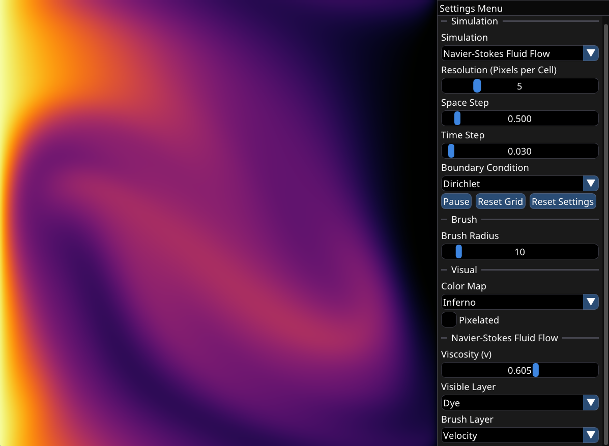

# PDE Sandbox

A simple numerical solver and sandbox for some partial differential equations to learn about numerical methods for solving differential equations.

[Link to Demo Video](https://youtu.be/d68Ic7olhRg)



## Installation and Building

There is a Windows build in the Releases tab. To build the project from source, ensure that you have CMake and C++ compiler installed. Then just run the following commands:

```bash
git clone --recursive https://github.com/tvumcc/pde-sandbox.git
cd this-repo
mkdir build
cd build
cmake -G "MinGW Makefiles" .. # Replace with your generator of choice
cmake --build .
```

The executable should be located in the build folder. Move the executable to the project's root directory before running the program to allow it to access the shaders and other assets.

## Atribution

* [Playlist by Aerodynamic CFD](https://www.youtube.com/playlist?list=PLcqHTXprNMINSc1n62_-SYUF963y_vYTT) - Used to learn about spatial discretization
* [VisualPDE](https://visualpde.com/) - For inspiration and presets for the Gray-Scott Reaction Diffusion Equations
* gehtsiegarnixan's [Matplotlib Color Maps for GLSL](https://www.shadertoy.com/view/Nd3fR2)